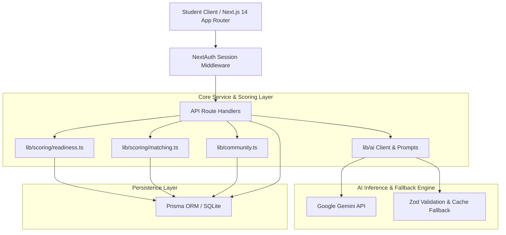

# Connect - AI Career Readiness & Talent Acceleration Platform

Connect is a full-stack, AI-powered career readiness platform engineered for undergraduate and graduate students. It bridges academic learning and competitive industry hiring through real-time skill gap intelligence, adaptive learning roadmaps, AI resume optimization, voice-enabled mock interviews, government/scholarship matching, and social cohort benchmarking.

---

## 🏗️ System Architecture



---

## 🚀 14-Feature Matrix (PRD Coverage)

| Feature | Description | Module | Status |
|---|---|---|---|
| **F1** | Profile & Academic Transcript Parsing (PDF/DOCX/TXT) | Module 1 | ✅ Verified |
| **F2** | Skill Gap Identification & Severity Classification | Module 1 | ✅ Verified |
| **F3** | Dynamic Career Pathway Recommendations | Module 2 | ✅ Verified |
| **F4** | Learning Resource & Certification Catalog | Module 2 | ✅ Verified |
| **F5** | AI Resume ATS Optimizer, Keywords & Diff Rewrites | Module 3 | ✅ Verified |
| **F6** | AI Voice & Text Mock Interview Simulator (STAR Method) | Module 4 | ✅ Verified |
| **F7** | Smart Job & Internship Matcher | Module 3 | ✅ Verified |
| **F8** | Government Employment & Apprenticeship Integrator | Module 5 | ✅ Verified |
| **F9** | Interactive Roadmap Canvas with Node Progress | Module 2 | ✅ Verified |
| **F10**| Target Employer & JD Intelligence Radar | Module 4 | ✅ Verified |
| **F11**| Scholarship & Financial Aid Eligibility Engine | Module 5 | ✅ Verified |
| **F12**| Deadline Reminder & 5-Column Kanban Tracker | Module 3 | ✅ Verified |
| **F13**| Target Company Competency Alignment Infographic | Module 1 | ✅ Verified |
| **F14**| Peer Learning, Challenges, Leaderboards & Badges | Module 6 | ✅ Verified |

---

## 🛠️ Architecture & Tech Stack

- **Framework:** Next.js 14 (App Router) + TypeScript
- **Styling:** Tailwind CSS + Radix UI + Lucide Icons + NextThemes (Dark/Light Mode)
- **Database & ORM:** SQLite via Prisma ORM
- **Authentication:** NextAuth (Credentials with bcrypt + Google OAuth ready)
- **AI Core:** Google Gemini API via typed `lib/ai` abstraction with caching, schema validation (Zod), retries, and deterministic fallbacks
- **Scoring Formulas:** Pure, deterministic scoring for Readiness, ATS match, and Scholarship eligibility
- **Testing:** Vitest unit test suite + End-to-end integration test runners

---

## ⚡ Instant Demo Mode (< 1s Idempotent Seed)

Connect includes an idempotent one-click demo data engine:
- Click the **"Load Demo Student"** button in the top navigation bar at any time, OR send `POST /api/demo/load`.
- In **< 1,000ms**, all 14 platform features are populated with realistic student transcripts, verified skills, active roadmaps, ATS resume analyses, Kanban job applications, completed mock interviews with structured feedback, saved scholarships with checklist items, community milestone posts, peer challenge submissions, and 5 unlocked badges.

---

## 🎬 5-Minute Evaluation Demo Script

1. **Dashboard & Readiness Score (`/dashboard`):**
   - Click "Load Demo Student" in the top bar.
   - Inspect the **73% Readiness Score** (blended across skills, roadmap, resume ATS, and interview).
   - View next priority roadmap step and upcoming deadlines.
2. **Skill Profile & Gap Radar (`/profile`):**
   - View extracted transcript skills with confidence scores.
   - Inspect the interactive radar comparison against Google benchmarks.
3. **AI Career Roadmap (`/roadmap`):**
   - Explore the 5-node learning path for Full Stack Web Developer.
   - Inspect completed nodes, in-progress nodes, and curated learning resources.
4. **Resume ATS Scanner & Applications (`/applications`):**
   - Inspect the 84% ATS match score, keyword tables, and before/after bullet rewrites.
   - Switch to Kanban tracker tab: view jobs across Saved, Applied, and Interviewing columns.
5. **Interview Preparation & Voice Simulator (`/interview`):**
   - Paste a JD or pick Google to extract culture signals, stack requirements, and practice questions.
   - Launch mock interview: conduct text or voice responses with live transcripts and STAR feedback.
6. **Government Opportunities & Scholarships (`/opportunities`):**
   - Filter government openings (NCS, Apprenticeship India) by type and state.
   - Review matched scholarships, check off eligibility requirements, and save to Kanban tracker.
7. **Community, Leaderboards & Challenges (`/community`):**
   - View cohort leaderboards with weekly/all-time filters and college sorting.
   - Share milestones in the Activity Feed and react with Like, Celebrate, or Support.
   - Submit peer challenge solutions and inspect earned verified portfolio badges.

---

## 📦 Getting Started

### 1. Prerequisites
- Node.js v18+ (tested on Node v20/v24)
- npm or pnpm

### 2. Installation
```bash
# Clone the repository
git clone https://github.com/your-org/connect.git
cd connect

# Install dependencies
npm install
```

### 3. Environment Setup
Create a `.env` file (or copy `.env.example`):
```env
DATABASE_URL="file:./dev.db"
NEXTAUTH_URL="http://localhost:3000"
NEXTAUTH_SECRET="your-development-secret-key"
GEMINI_API_KEY="" # Optional: Add your Gemini API key (built-in deterministic fallback included)
ENCRYPTION_KEY="0123456789abcdef0123456789abcdef0123456789abcdef0123456789abcdef"
```

### 4. Database Setup & Seed
```bash
# Push Prisma schema to SQLite
npm run db:push

# Seed competencies, companies, benchmarks, and demo student
npm run db:seed
```

Demo Credentials:
- **Email:** `demo@connect.dev`
- **Password:** `Demo1234!`

### 5. Running the Application
```bash
npm run dev
```
Open [http://localhost:3000](http://localhost:3000) in your browser.

---

## 🧪 Comprehensive Integration Test Suite

Connect contains dedicated integration test suites validating all modules:

```bash
# Phase 2: Skills, Gaps & Radar
node scratch/test-phase2.mjs

# Phase 3: Roadmaps & Learning Resources
node scratch/test-phase3.mjs

# Phase 4: Resume ATS & Kanban Tracker
node scratch/test-phase4.mjs

# Phase 5: Interview Intelligence & Mock Simulator
node scratch/test-phase5.mjs

# Phase 6: Government Jobs & Scholarships
node scratch/test-phase6.mjs

# Phase 7: Community, Dashboard & Demo Mode
node scratch/test-phase7.mjs
```
